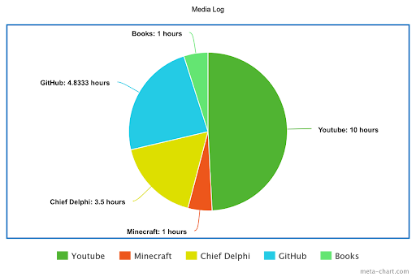

# How do I manage being inundated with information constantly?

Every day, I consume _massive_ amounts of information, lots of it programming/robotics related. I spend hours on GitHub, reading up on new features that people are making, and Chief Delphi, constantly looking at threads to see if there's important information regarding a vendor. That's a lot of information to consume, so how do I manage that much information? The secret is in my Media Log.

# Balancing

My media log has captured just how much I watch YouTube. YouTube is a way for my brain to unwind; a way to shut off my brain and just listen and observe whatever video is playing. I can just mindlessly scroll through short-form videos, or watch long-form gaming content to relax and entertain myself. My media log shows my balance of media consumption; half the time, I'm consuming information. The other half of the time, I have my brain turned off and I'm relaxing, watching YouTube videos. Most of the videos don't have useful information, so YouTube is my way of limiting my information consumption.